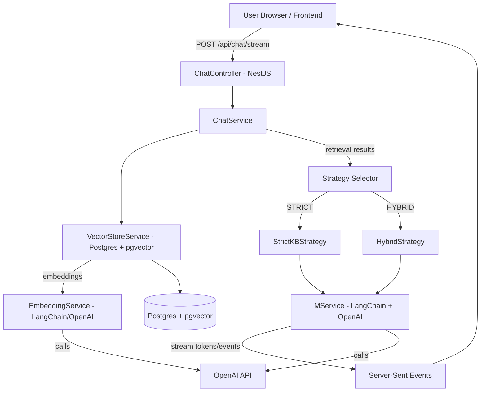

# ARCHITECTURE.md — CoralTalk Chatbot (Backend)

> A detailed architecture, rationale, and design-decision record for the CoralTalk knowledge-grounded chatbot backend.
---

## Table of contents

- [ARCHITECTURE.md — CoralTalk Chatbot (Backend)](#architecturemd--coraltalk-chatbot-backend)
  - [Table of contents](#table-of-contents)
  - [Purpose \& Scope](#purpose--scope)
  - [High-level overview \& goals](#high-level-overview--goals)
  - [Architecture diagram](#architecture-diagram)
  - [Component breakdown](#component-breakdown)
  - [Data flow (step-by-step)](#data-flow-step-by-step)
  - [Key design decisions, rationale \& trade-offs](#key-design-decisions-rationale--trade-offs)
    - [Language \& framework: Node.js + NestJS](#language--framework-nodejs--nestjs)
    - [LLM orchestration: LangChainJS (not LlamaIndex)](#llm-orchestration-langchainjs-not-llamaindex)
    - [Vector store: PostgreSQL + pgvector (not vector database like pinecone)](#vector-store-postgresql--pgvector-not-vector-database-like-pinecone)
    - [Streaming: SSE (not WebSocket or Polling)](#streaming-sse-not-websocket-or-polling)
    - [Strategy pattern: Hybrid \& Strict paths](#strategy-pattern-hybrid--strict-paths)
  - [Confidence scoring \& thresholds (interview-ready explanation)](#confidence-scoring--thresholds-interview-ready-explanation)
    - [Why these thresholds?](#why-these-thresholds)
  - [Production-ready multi-factor confidence plan](#production-ready-multi-factor-confidence-plan)
  - [Database schema \& storage](#database-schema--storage)
  - [APIs, SSE events \& expected behavior](#apis-sse-events--expected-behavior)
  - [Operational considerations \& deployments (Neon, Supabase, RDS)](#operational-considerations--deployments-neon-supabase-rds)
  - [Security, observability \& costs](#security-observability--costs)
  - [Testing \& evaluation strategy](#testing--evaluation-strategy)
  - [Future work \& improvements](#future-work--improvements)
  - [Docs \& references in this repo](#docs--references-in-this-repo)

---

## Purpose & Scope

This document captures *what* the system is, *why* i chose each major component, and *how* the pieces fit together. It is intentionally opinionated and includes trade-offs so a reviewer can understand design intent and constraints.

The system is a prototype Knowledge Grounded Chatbot:

* Ingests internal documents into a searchable vector format.
* Exposes two response pathways:

  1. **KB-only (Strict)** — only answers from the knowledge base when confidence is high.
  2. **Hybrid (KB + LLM)** — augments retrieved context with a general LLM when confidence is moderate or toggle enabled.
* Streams tokens to the frontend via **SSE** for a responsive chat experience.

---

## High-level overview & goals

* Provide accurate, citation-backed answers when the KB contains the answer.
* Provide helpful, conversational answers using a general LLM when the KB is insufficient or the user requests it.
* Be easy to run locally and compatible with managed Postgres offerings (Neon, Supabase) for deployment.
* Fit the assessment constraints (fast iteration, clear separation of concerns, and clear documentation).

---

## Architecture diagram



---

## Component breakdown

**NestJS Modules**

* `chat/` — controller, service, DTOs, strategies (hybrid & strict), prompts.
* `retrieval/` — `VectorStoreService` (search, addChunks, createDocument, stats), `EmbeddingService`.
* `llm/` — `LLMService` abstraction (streams completions, handles model config).
* `prisma/` — `PrismaService` for DB access.
* `ingestion/` — ingestion pipeline for loading files and splitting into chunks.

**Key classes**

* `ChatController` — HTTP + SSE endpoints (`/api/chat/stream`, `/api/chat/test`, `/api/chat/health`).
* `ChatService` — orchestrates retrieval → strategy → LLM streaming.
* `VectorStoreService` — embedding storage and search using `embedding <=> vector` SQL with pgvector.
* `EmbeddingService` — wraps `OpenAIEmbeddings` from LangChain to embed queries & documents.
* `HybridStrategy` / `StrictKBStrategy` — decide which prompt/flow to use based on top similarity score.
* `LLMService` — handles streaming completions into an `Observable<SSEEvent>`.

---

## Data flow (step-by-step)

1. **Client** posts query to `/api/chat/stream` with `useGeneralLLM` flag.
2. `ChatController` calls `ChatService.handleQuery(dto)`.
3. `ChatService` calls `VectorStoreService.search(query)`:

   * `EmbeddingService.embedQuery(query)` → embedding vector.
   * SQL query computes similarity with stored vectors and returns top-K results.
4. `ChatService` selects strategy:

   * If `useGeneralLLM` is `false`: `StrictKBStrategy` (uses `strictKBConfidenceThreshold`).
   * Else: `HybridStrategy` (uses `highConfidenceThreshold`, `lowConfidenceThreshold`).
5. Strategy constructs prompt (STRICT / AUGMENTED / GENERAL with context) and calls `LLMService.streamCompletion(prompt, sourceLabel, topScore, temperature?)`.
6. `LLMService` streams tokens and citation events back; emitted `SSEEvent` objects are converted to SSE by `ChatController`.
7. Client receives token-by-token updates and citation event(s) and displays them in the chat UI.

---

## Key design decisions, rationale & trade-offs

### Language & framework: Node.js + NestJS

**Why**:

* Fast delivery for a timed assessment
* Native TypeScript gives compile-time guarantees for DTOs, config, and services.
* NestJS provides DI, modularization, and integrated Swagger for API docs; streamlines building the strategy pattern.

**Trade-offs**:

* Python would provide richer ML tooling (e.g., LlamaIndex ecosystem), but that advantage is minimal for a Node-centric integration with OpenAI and LangChainJS. The orchestration layer benefits from Node’s non-blocking I/O and TypeScript safety.

### LLM orchestration: LangChainJS (not LlamaIndex)

**Why**:

* LangChainJS integrates with OpenAI embeddings and streaming and provides common interfaces for loaders & splitters.
* LlamaIndex is excellent in Python but the JS ecosystem is more mature for Node deployments; LangChain allows reusing templates/pipelines while letting us control orchestration from NestJS.

**Trade-offs**:

* LangChain can be verbose; we mitigate this by wrapping it behind `EmbeddingService` and `LLMService` for a clean internal API.
* If the project needed advanced indexing or reranking, LlamaIndex (Python) or a custom reranker may be revisited.

### Vector store: PostgreSQL + pgvector (not vector database like pinecone)

**Why**:

* Simplicity & demonstration: store both structured data and vectors in a single DB.
* Prisma integrates well for migrations and development ergonomics.
* Works locally and with managed providers (Neon, Supabase) for production.

**Trade-offs**:

* At extreme scale, dedicated vector DBs (Pinecone, Qdrant) can be faster and provide vector-specific features; but for this assessment and early-stage product, pgvector is the pragmatic choice.

### Streaming: SSE (not WebSocket or Polling)

**Why**:

* SSE is a one-way stream from server → client. LLM output is unidirectional, making SSE a perfect fit.
* Browser-native EventSource is easy to integrate, avoids managing socket lifecycle/heartbeats, and reduces infra complexity.

**Trade-offs**:

* If you later need bi-directional low-latency interactions, add WebSocket or a WebRTC layer. For chat streaming, SSE is the simplest, most robust option.

### Strategy pattern: Hybrid & Strict paths

**Why**:

* Clear separation of responsibilities: `HybridStrategy` (augmented responses) vs `StrictKBStrategy` (KB-only, fail fast).
* Easier to test thresholds, prompts, and to add new strategies (e.g., reranker, multi-step QA).

**Trade-offs**:

* Slight complexity in logic; however this gives clarity and testability.

---

## Confidence scoring & thresholds

This is central to the RAG behavior.

**Configured thresholds (MVP):**

* `CONFIDENCE_THRESHOLD_HIGH = 0.70` — gate for using KB-only strict prompt (very confident).
* `STRICT_KB_CONFIDENCE_THRESHOLD = 0.45` — fail-fast gate for strict mode.
* `CONFIDENCE_THRESHOLD_LOW = 0.40` — floor; below this we rely on general LLM knowledge.

### Why these thresholds?

> These numbers are empirical heuristics tuned on the document corpus and the embedding model (`text-embedding-3-small`). They balance **precision** (avoiding false confident KB answers) and **recall** (not missing helpful context).

---

## Production-ready multi-factor confidence plan

**Current MVP** uses top-chunk cosine similarity alone.

**Production plan** (recommended):
A weighted 4-factor confidence score:

1. **Semantic Similarity** (40%) — cosine over top-3 chunks.
2. **Answer Consistency** (30%) — LLM answers generated independently from chunk 1 and chunk 2, measured for convergence (BLEU or embedding similarity).
3. **Keyword Coverage** (20%) — fraction of query entities found in context.
4. **Contextual Sufficiency** (10%) — a small classifier predicting "sufficient context" trained on labeled pairs.

**Weighted Formula**:

```text
confidence = 0.4*semantic + 0.3*consistency + 0.2*keyword_coverage + 0.1*sufficiency
```

**Fallback thresholds**:

* > 0.85 → KB only
* 0.65–0.85 → KB + LLM (hybrid)
* < 0.65 → LLM-only

**Why not implement now**: time-to-value: MVP cosine heuristic yields ~80% of benefit for a small fraction of engineering effort.

---

## Database schema & storage

*Primary models (Prisma schema):*

* `Document` — id, name, content, timestamps
* `DocumentChunk` — id, documentId, content, embedding (vector(1536)), chunkIndex, metadata, createdAt
* `ChatHistory` — id, query, response, mode, source, confidence, createdAt

**Notes**

* `vector` extension for PostgreSQL (pgvector) is used.
* Prisma `previewFeatures = ["postgresqlExtensions"]` is enabled to support vector types.
* The `DocumentChunk.embedding` is stored as an `Unsupported("vector(1536)")` mapping in Prisma; SQL inserts use `[...]::vector`.

---

## APIs, SSE events & expected behavior

**Endpoints**

* `POST /api/chat/stream` — SSE streaming chat. Accepts `{ query, useGeneralLLM, conversationHistory? }`. Streams events.
* `POST /api/chat/test` — non-streamed test endpoint; aggregates stream into a single response for debugging.
* `GET /api/chat/health` — health & stats.

**SSE Events**

* `token` — raw token string to append to display.
* `citation` — JSON `{ source, confidence, notes? }`.
* `end` — signal completion.
* `error` — error messages.

**Behavior**

* When `useGeneralLLM` = `false`: strict path; if top score < `STRICT_KB_CONFIDENCE_THRESHOLD` return a `NO_ANSWER_PHRASE` stream and citation noting "no relevant context".
* When `useGeneralLLM` = `true`: behave hybrid — may call LLM for augmentation unless `topScore >= high threshold` in which case use KB-only prompt.

---

## Operational considerations & deployments (Neon, Supabase, RDS)

**Local dev**

* Use local Postgres, enable `vector` extension:
  `psql -d knowledge_chatbot -c "CREATE EXTENSION IF NOT EXISTS vector;"`

**Managed providers**

* Neon / Supabase / RDS are supported; set `DATABASE_URL` to the provider connection string in `.env`.
* For Neon/Supabase, ensure `sslmode=require` in the connection string if required.
* Prisma migrations and `prisma migrate dev` work against managed DBs, but be careful with migrations in serverless contexts—use CI/CD pipelines for production migrations.

**Scaling notes**

* For large corpora, consider dedicated vector DBs (Pinecone, Qdrant) and move heavy similarity search off Postgres.
* Add Redis cache to store top-K results for repeated queries.

---

## Security, observability & costs

**Security**

* `OPENAI_API_KEY` in server env only; never exposed to frontend.
* CORS whitelisting using `CORS_ORIGIN` env var.

---

## Future work & improvements

* Implement the multi-factor confidence algorithm and run an A/B test vs the cosine-only baseline.
* Add a reranker model (e.g., Cohere ReRank) for smarter retrieval sorting to polish top-K before sending to LLM.
* Add document metadata filters (date, author) to retrieval.
* Consider a managed vector DB or hybrid (pgvector for small corpora, Pinecone/Qdrant for scale).
* Add role-based access control, rate limiting, and API keys for public deployments.
* Add document versioning and metadata filters
* Introduce semantic caching for repeated queries

---

## Docs & references in this repo

* `README.md` — Setup and quick start (root).
* `docs/ARCHITECTURE.md` — this file (or `/ARCHITECTURE.md`).
* `docs/API_DESIGN.md` — API endpoint structure and SSE format.
* `docs/DATABASE_DESIGN.md` — Prisma schema + migration notes.


