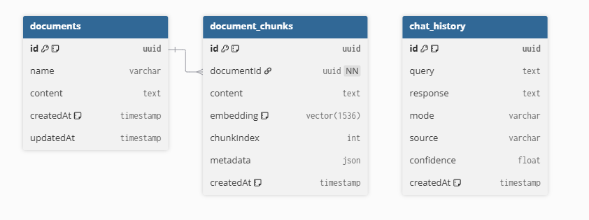

## Overview

The database underpins the Knowledge Grounded Chatbot’s Retrieval-Augmented Generation (RAG) pipeline and chat history.
It uses **PostgreSQL with the `pgvector` extension**, accessed through **Prisma ORM** for type-safe and maintainable schema evolution.

This design supports both **local** and **external** PostgreSQL deployments:

* Local development: Dockerized Postgres + `pgvector`
* Cloud-hosted: Supabase, Neon, or any managed Postgres with `pgvector` enabled
* Optional: Pinecone (or other managed vector stores) can replace the vector layer without altering business logic

---

## Entities & Relationships

### Entity-Relationship Diagram (ERD)

```
+------------------+
|    Document      |
+------------------+
| id (PK)          |
| name             |
| content          |
| createdAt        |
| updatedAt        |
+------------------+
         |
         | 1-to-many
         v
+----------------------+
|   DocumentChunk      |
+----------------------+
| id (PK)              |
| documentId (FK) ---> Document.id
| content              |
| embedding (vector)   |
| chunkIndex           |
| metadata (JSON)      |
| createdAt            |
+----------------------+

+----------------------+
|   ChatHistory        |
+----------------------+
| id (PK)              |
| query                |
| response             |
| mode (KB / Hybrid)   |
| source (LLM / KB)    |
| confidence (float)   |
| createdAt            |
+----------------------+
```

---

## Model Summaries

### `Document`

Stores the original text document (e.g., company FAQ, policy, or guide).
Each `Document` is split into multiple `DocumentChunk`s for vectorization.

| Field       | Type            | Description                                   |
| ----------- | --------------- | --------------------------------------------- |
| `id`        | `String (uuid)` | Unique identifier                             |
| `name`      | `String`        | Display name of the document                  |
| `content`   | `Text`          | Raw text (used for re-embedding or debugging) |
| `createdAt` | `DateTime`      | Insert timestamp                              |
| `updatedAt` | `DateTime`      | Auto-updated timestamp                        |
| `chunks`    | Relation        | One-to-many → `DocumentChunk[]`               |

✅ **Indexes & Optimizations**

* Index on `id`
* Cascade delete ensures all chunks are removed when a document is deleted

---

### `DocumentChunk`

Stores the vectorized segments of a document.
Each chunk includes a `content` field and a `vector(1536)` embedding for semantic retrieval.

| Field        | Type            | Description                                                |
| ------------ | --------------- | ---------------------------------------------------------- |
| `id`         | `String (uuid)` | Primary key                                                |
| `documentId` | `String (FK)`   | Foreign key to `Document`                                  |
| `content`    | `Text`          | The text portion of the document                           |
| `embedding`  | `vector(1536)`  | 1536-dimensional embedding (from `text-embedding-3-small`) |
| `chunkIndex` | `Int`           | Sequential index for chunk ordering                        |
| `metadata`   | `Json?`         | Optional metadata (page number, section title, etc.)       |
| `createdAt`  | `DateTime`      | Insert timestamp                                           |

✅ **Indexes & Optimizations**

* Index on `documentId`
* Using PostgreSQL’s `vector` type for fast cosine similarity queries

---

### `ChatHistory`

Stores all user queries, responses, and confidence scores — useful for analytics, debugging, and retraining retrieval thresholds.

| Field        | Type            | Description                                                 |
| ------------ | --------------- | ----------------------------------------------------------- |
| `id`         | `String (uuid)` | Unique message ID                                           |
| `query`      | `Text`          | User’s raw input                                            |
| `response`   | `Text`          | Model’s final response (stream aggregated)                  |
| `mode`       | `String`        | "strict" (KB-only) or "hybrid" (LLM + KB)                   |
| `source`     | `String`        | Indicates final source of answer (`KB`, `LLM`, or `Hybrid`) |
| `confidence` | `Float?`        | Confidence score (e.g., cosine similarity or heuristic)     |
| `createdAt`  | `DateTime`      | Insert timestamp                                            |

✅ **Indexes & Optimizations**

* Index on `createdAt` for chronological queries
* Enables analytics (e.g., avg confidence, fallback frequency)

---

## Rationale

| Design Choice                          | Rationale                                                                                  |
| -------------------------------------- | ------------------------------------------------------------------------------------------ |
| **PostgreSQL + pgvector**              | Unified storage for relational and semantic data (no need for separate DBs like Pinecone). |
| **Prisma ORM**                         | Strong typing, automatic migrations, and schema portability.                               |
| **vector(1536)**                       | Matches OpenAI `text-embedding-3-small` output dimensionality.                             |
| **One-to-Many (Document → Chunks)**    | Enables flexible document-level management and fast deletions.                             |
| **Confidence Tracking in ChatHistory** | Enables calibration of similarity thresholds and fallback logic.                           |

---

## Future Extensions

| Feature                    | Description                                                |
| -------------------------- | ---------------------------------------------------------- |
| `User` table               | Multi-user chat histories and auth.                        |
| `Feedback` table           | Store thumbs-up/down for RAG tuning.                       |
| `embedding_version` column | Track when embeddings were regenerated.                    |
| `vector_index`             | Use `ivfflat` for even faster retrieval on large datasets. |

---

## Summary

| Category        | Choice                   | Why                                        |
| --------------- | ------------------------ | ------------------------------------------ |
| DB Type         | PostgreSQL + pgvector    | Unified, flexible, production-ready        |
| ORM             | Prisma                   | Type safety, migrations, ease of use       |
| Vector Dim      | 1536                     | Matches OpenAI embedding model             |
| Relations       | Document → DocumentChunk | Natural document structure                 |
| Hosting         | Local / Supabase / Neon  | Flexible for both dev and cloud            |
| RAG Integration | ChatHistory + confidence | Enables threshold-based response switching |

